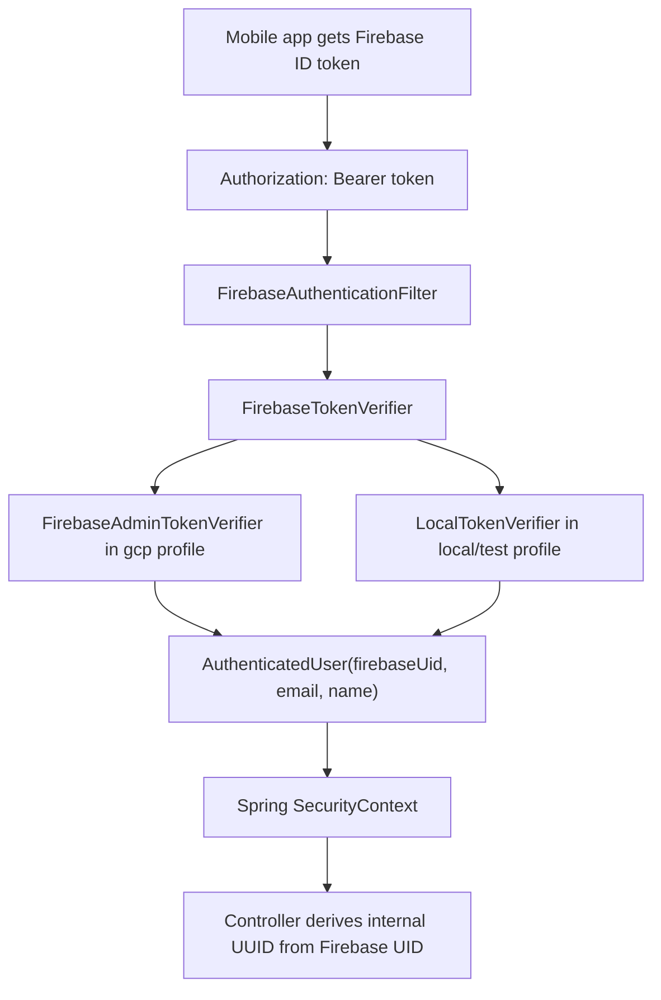
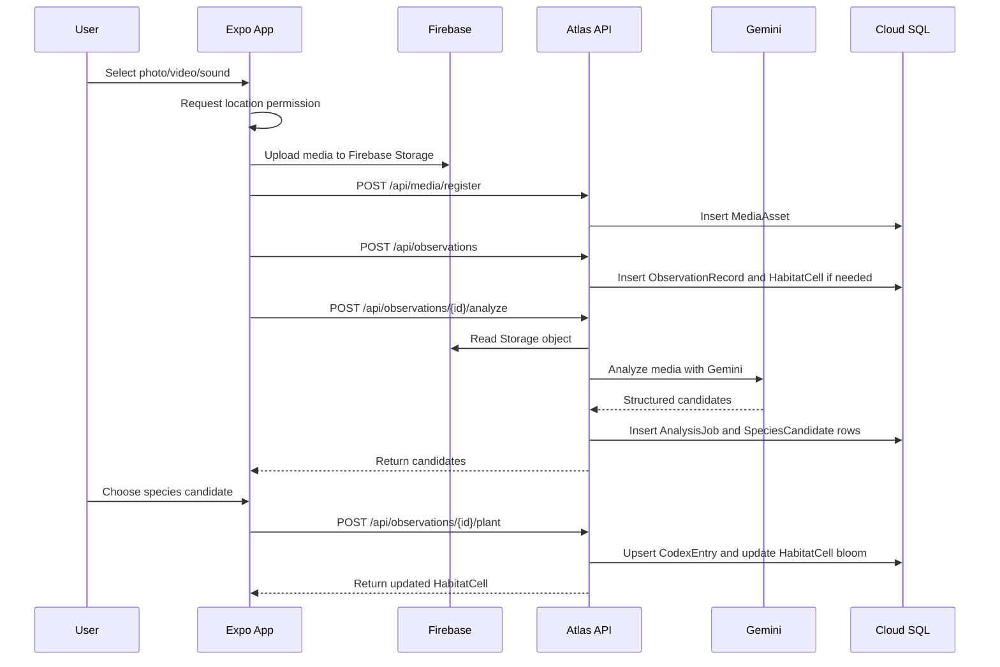

# Atlas Backend Architecture And Connection Guide

Last updated: 2026-05-21

This document describes the current backend implementation, how the mobile app connects to it, and what still needs to be completed before the backend can be considered production-ready.

## 1. Current Repository Layout

Atlas currently uses the repository root as the Spring Boot backend workspace. The Expo mobile app lives under `mobile/`.

```text
.
├── Dockerfile
├── pom.xml
├── README.md
├── docs/
├── mobile/
└── src/
    ├── main/java/com/atlas/api/
    ├── main/resources/application.yml
    └── main/resources/db/migration/V1__init_atlas_schema.sql
```

Important backend package boundaries:

```text
com.atlas.api
├── analysis      Gemini analysis jobs, candidates, parser, Gemini HTTP client
├── auth          Firebase ID token auth, local token verifier, Firebase Admin config
├── codex         Cell-level species codex entries
├── common        API errors and exception handling
├── config        Spring Security configuration
├── habitat       HabitatCell model, cell key resolution, cell APIs
├── media         Firebase Storage metadata registration
└── observation   Observation creation, analysis orchestration, planting, bloom score
```

## 2. Runtime Stack

Backend:

- Java 21
- Spring Boot 3.5.9
- Spring Web
- Spring Security
- Spring Data JPA
- Bean Validation
- Actuator
- Flyway
- PostgreSQL for GCP/Cloud SQL
- H2 for local/test bootstrap
- Firebase Admin SDK
- Firebase Storage Admin access
- Gemini API through HTTP

Deployment/runtime:

- Docker image is built by `Dockerfile`.
- Cloud Run can run the built container.
- Cloud SQL PostgreSQL is the production database target.
- Firebase Authentication is the source of user identity.
- Firebase Storage is the media object store.

## 3. Profiles

### 3.1 `local` Profile

The default Spring profile is `local`.

Behavior:

- Uses H2 in-memory DB.
- Uses `LocalTokenVerifier`.
- Accepts any non-empty bearer token except `invalid`.
- Uses the stub Gemini client.
- Useful for local backend and frontend shape development.

Run:

```bash
mvn spring-boot:run
```

Smoke test:

```bash
curl http://localhost:8080/actuator/health

curl -H "Authorization: Bearer local-user" \
  http://localhost:8080/api/habitat-cells/nearby
```

### 3.2 `gcp` Profile

The `gcp` profile is used for Cloud Run or local real-service testing.

Behavior:

- Uses PostgreSQL through `DB_JDBC_URL`.
- Uses Flyway migrations and validates schema with JPA.
- Uses Firebase Admin SDK to verify real Firebase ID tokens.
- Uses Firebase Admin credentials to read Storage objects during Gemini analysis.
- Uses the real Gemini HTTP API.

Run locally with real GCP services:

```bash
mvn spring-boot:run -Dspring-boot.run.profiles=gcp
```

## 4. Required Backend Environment Variables

Never commit these values.

```bash
export SPRING_PROFILES_ACTIVE=gcp
export DB_JDBC_URL="jdbc:postgresql://<host>:5432/<database>?sslmode=require"
export DB_USERNAME="<cloud-sql-db-user>"
export DB_PASSWORD="<cloud-sql-db-password>"
export GEMINI_API_KEY="<gemini-api-key>"
export GEMINI_MODEL="gemini-3.1-flash-lite"
export FIREBASE_STORAGE_BUCKET="<firebase-storage-bucket>"
export FIREBASE_SERVICE_ACCOUNT_PATH="/path/to/firebase-service-account.json"
```

Notes:

- `GEMINI_MODEL` is optional because `gemini-3.1-flash-lite` is the default.
- `FIREBASE_SERVICE_ACCOUNT_PATH` is optional on Cloud Run if Application Default Credentials are correctly available through the Cloud Run service account.
- For local `gcp` profile testing, `FIREBASE_SERVICE_ACCOUNT_PATH` is the simplest path.
- `DB_JDBC_URL` should include `sslmode=require` when using a public Cloud SQL PostgreSQL IP.
- Cloud SQL connector/private networking should replace public IP access before production hardening.

Current development Cloud Run API base URL:

```text
https://atlas-api-ngaj2pc2na-du.a.run.app
```

## 5. Authentication Model

Atlas does not accept `userId` from request bodies.

The client must:

1. Sign in through Firebase Authentication.
2. Receive a Firebase ID token.
3. Send the token to Atlas API on every protected request.

```http
Authorization: Bearer <firebase-id-token>
```

Backend flow:



Internal user ID:

- The backend converts Firebase UID into a stable internal UUID with `UUID.nameUUIDFromBytes(firebaseUid)`.
- This means mobile requests never need to send user identity manually.

Public endpoint:

- `GET /actuator/health`

Protected endpoints:

- All `/api/**` routes require a bearer token.

## 6. Data Model

Initial schema is managed by:

```text
src/main/resources/db/migration/V1__init_atlas_schema.sql
```

Tables:

| Table | Purpose |
| --- | --- |
| `habitat_cells` | Public map cell state, bloom score, public cell center |
| `media_assets` | Metadata for objects uploaded to Firebase Storage |
| `observation_records` | Private exact observation coordinates and capture state |
| `analysis_jobs` | One Gemini analysis attempt for an observation |
| `species_candidates` | Candidate species returned by Gemini |
| `codex_entries` | Cell-level species entries after user confirmation |

Privacy rule in the current model:

- `observation_records.exact_lat` and `exact_lng` store exact private coordinates.
- `observation_records.public_lat` and `public_lng` store the HabitatCell center.
- Public map APIs should use cell-level coordinates, not exact coordinates.

## 7. HabitatCell Resolution

Cell resolution is implemented in `CellKeyService`.

Current logic:

- `atlas.cells.size-degrees` defaults to `0.0025`.
- Latitude and longitude are converted to integer grid indexes with `floor(value / cellSizeDegrees)`.
- Cell key format is:

```text
h:<latIndex>:<lngIndex>
```

- Cell center is calculated from the grid index.
- If an observation lands in a new cell, the backend creates that `HabitatCell`.

Current limitation:

- `GET /api/habitat-cells/nearby` currently returns all cells.
- It does not yet accept the mobile user's location or radius.
- The intended next step is a 5km nearby query with latitude, longitude, and radius parameters.

## 8. API Contract

All API routes below require:

```http
Authorization: Bearer <firebase-id-token>
Content-Type: application/json
```

### 8.1 Health

```http
GET /actuator/health
```

Response:

```json
{
  "status": "UP"
}
```

### 8.2 Register Media Metadata

The mobile app uploads the binary file to Firebase Storage first. Then it registers only metadata with Atlas.

```http
POST /api/media/register
```

Request:

```json
{
  "type": "PHOTO",
  "storageKey": "firebase://<bucket>/users/<firebaseUid>/observations/<object>",
  "mimeType": "image/jpeg",
  "sizeBytes": 123456,
  "checksum": "<client-calculated-checksum>"
}
```

Response:

```json
{
  "id": "<media-asset-uuid>",
  "type": "PHOTO",
  "storageKey": "firebase://<bucket>/users/<firebaseUid>/observations/<object>",
  "mimeType": "image/jpeg"
}
```

Current limitation:

- The backend stores the provided metadata.
- Object existence, owner path, MIME, size, and checksum validation still need hardening.
- During Gemini analysis, the backend reads the object from Firebase Storage using `storageKey`.

### 8.3 Create Observation

```http
POST /api/observations
```

Request:

```json
{
  "mediaAssetIds": ["<media-asset-uuid>"],
  "latitude": 37.5665,
  "longitude": 126.978,
  "locationAccuracyMeters": 12.5,
  "capturedAt": "2026-05-21T02:30:00Z"
}
```

Backend behavior:

1. Validates latitude and longitude ranges.
2. Resolves coordinates into a HabitatCell.
3. Creates the cell if it does not exist.
4. Stores exact coordinates privately.
5. Stores public coordinates as the cell center.
6. Creates an `ObservationRecord`.

Response:

```json
{
  "id": "<observation-uuid>",
  "habitatCellId": "<cell-uuid>",
  "status": "CREATED",
  "publicLat": 37.56625,
  "publicLng": 126.97875
}
```

### 8.4 Analyze Observation

```http
POST /api/observations/{id}/analyze
```

Current behavior:

- Creates an `AnalysisJob`.
- Marks the observation as analyzing.
- Reads linked Firebase Storage media objects.
- Calls Gemini with inline base64 media parts.
- Requests structured JSON output.
- Parses species candidates.
- Stores `SpeciesCandidate` rows.
- Marks the job as succeeded or failed.
- Returns the analysis response.

Response:

```json
{
  "jobId": "<analysis-job-uuid>",
  "observationRecordId": "<observation-uuid>",
  "model": "gemini-3.1-flash-lite",
  "status": "SUCCEEDED",
  "candidates": [
    {
      "id": "<species-candidate-uuid>",
      "commonNameKo": "노랑나비",
      "scientificName": "Pieris rapae",
      "confidence": 0.87,
      "evidence": "날개 색과 무늬가 일치합니다."
    }
  ]
}
```

Current limitation:

- The endpoint currently performs analysis during the request.
- The frontend already supports polling, but the backend should later split job creation and async execution.

### 8.5 Get Analysis Job

```http
GET /api/analysis-jobs/{id}
```

Response shape is the same as the analyze response.

### 8.6 Plant Observation Into Cell Codex

```http
POST /api/observations/{id}/plant
```

Request:

```json
{
  "speciesCandidateId": "<species-candidate-uuid>",
  "visibility": "CELL"
}
```

Supported visibility values:

- `PRIVATE`
- `CELL`
- `PUBLIC`

Backend behavior:

1. Loads the observation.
2. Loads the selected species candidate.
3. Finds or creates a `CodexEntry` in the observation's HabitatCell.
4. Adds observation count and confidence to the codex entry.
5. Marks the observation as planted.
6. Recalculates the cell bloom state.
7. Returns the updated `HabitatCell`.

Response:

```json
{
  "id": "<cell-uuid>",
  "cellKey": "h:15000:50791",
  "centerLat": 37.50125,
  "centerLng": 126.97875,
  "bloomState": "BLOOMED",
  "bloomScore": 64,
  "observationCount": 8,
  "speciesCount": 3,
  "contributorCount": 1
}
```

Current limitation:

- `contributorCount` is currently simplified.
- Contributor identity display and opt-in naming still need a user/profile model.

### 8.7 List Nearby Habitat Cells

```http
GET /api/habitat-cells/nearby
```

Response:

```json
[
  {
    "id": "<cell-uuid>",
    "cellKey": "h:15000:50791",
    "centerLat": 37.50125,
    "centerLng": 126.97875,
    "bloomState": "SEEDED",
    "bloomScore": 24,
    "observationCount": 1,
    "speciesCount": 1,
    "contributorCount": 1
  }
]
```

Current limitation:

- It returns every cell for now.
- It should become location/radius scoped for the community and map views.

### 8.8 Get One Habitat Cell

```http
GET /api/habitat-cells/{id}
```

Returns one `HabitatCell`.

### 8.9 List Cell Codex Entries

```http
GET /api/habitat-cells/{cellId}/codex
```

Response:

```json
[
  {
    "id": "<codex-entry-uuid>",
    "habitatCellId": "<cell-uuid>",
    "speciesKey": "pieris-rapae",
    "displayName": "노랑나비",
    "observationCount": 3,
    "bestConfidence": 0.92
  }
]
```

## 9. Gemini Integration

Implementation:

```text
src/main/java/com/atlas/api/analysis/GeminiHttpAnalysisClient.java
src/main/java/com/atlas/api/analysis/GeminiResponseParser.java
```

Current request behavior:

- The backend reads media objects from Firebase Storage.
- Each media file is sent to Gemini as `inlineData`.
- The prompt uses public cell coordinates, not exact coordinates.
- `generationConfig.responseMimeType` is `application/json`.
- A JSON schema asks Gemini to return `candidates`.

Current parser behavior:

- Reads Gemini response text from `candidates[0].content.parts[0].text`.
- Parses that text as JSON.
- Requires `commonNameKo`, `scientificName`, `confidence`, and `evidence`.
- Normalizes confidence into the `0..1` range.
- Fails analysis if candidates are missing or invalid.

Important security rule:

- `GEMINI_API_KEY` must only exist on the backend.
- The mobile app must never receive or store the Gemini API key.

## 10. Mobile App Connection

Mobile connection files:

```text
mobile/src/config/env.ts
mobile/src/features/auth/AuthProvider.tsx
mobile/src/services/firebaseAuthRest.ts
mobile/src/services/firebaseStorageRest.ts
mobile/src/services/api.ts
mobile/src/features/observation/ObservationFlowProvider.tsx
```

Required mobile public env:

```bash
EXPO_PUBLIC_ATLAS_API_BASE_URL="https://atlas-api-ngaj2pc2na-du.a.run.app"
EXPO_PUBLIC_FIREBASE_API_KEY="<firebase-web-api-key>"
EXPO_PUBLIC_FIREBASE_AUTH_DOMAIN="<project-id>.firebaseapp.com"
EXPO_PUBLIC_FIREBASE_PROJECT_ID="<project-id>"
EXPO_PUBLIC_FIREBASE_STORAGE_BUCKET="<firebase-storage-bucket>"
EXPO_PUBLIC_FIREBASE_APP_ID="<firebase-app-id>"
```

Mobile auth flow:

1. `AuthProvider` reads `EXPO_PUBLIC_FIREBASE_API_KEY`.
2. The app signs in anonymously through Firebase Auth REST.
3. The app stores the Firebase ID token and refresh token in AsyncStorage.
4. `api.ts` adds `Authorization: Bearer <idToken>` to protected API calls.

Mobile observation flow:



## 11. Verifying The Connection

### 11.1 Backend Health

```bash
curl -fsS "$EXPO_PUBLIC_ATLAS_API_BASE_URL/actuator/health"
```

Expected:

```json
{"status":"UP"}
```

### 11.2 Protected API Should Reject Missing Token

```bash
curl -i "$EXPO_PUBLIC_ATLAS_API_BASE_URL/api/habitat-cells/nearby"
```

Expected:

```text
HTTP/2 401
```

### 11.3 Protected API With Firebase ID Token

Get a Firebase ID token from the mobile app session or Firebase Auth REST, then:

```bash
curl -H "Authorization: Bearer <firebase-id-token>" \
  "$EXPO_PUBLIC_ATLAS_API_BASE_URL/api/habitat-cells/nearby"
```

Expected:

- `200 OK`
- JSON array of HabitatCell objects

### 11.4 Expo Go

```bash
cd mobile
npx expo start --clear
```

Expected:

- App signs in anonymously.
- Home map can call backend health and nearby HabitatCell APIs.
- Record flow can upload to Firebase Storage, register media, create observation, request Gemini analysis, and plant the selected candidate.

## 12. Current Completion Boundary

Implemented:

- Spring Boot backend skeleton and domain model.
- Firebase ID token auth path.
- Cloud SQL schema and Flyway migration.
- Firebase Storage metadata registration.
- Observation creation with private exact coordinates and public cell coordinates.
- Gemini analysis client and structured response parser.
- Candidate planting into cell codex.
- HabitatCell bloom score update.
- Mobile service layer connection to the backend.

Still needed:

- 5km community feed API.
- Location/radius scoped `nearby` query.
- Firebase Storage object ownership and checksum verification.
- Fully async `AnalysisJob` execution.
- Stronger Gemini schema validation and retry policy.
- User profile table for contributor display opt-in.
- Email/social Firebase auth UI wiring.
- API integration tests against real Firebase token and Cloud SQL.
- Production Cloud Run hardening with Secret Manager and Cloud SQL connector/private networking.

