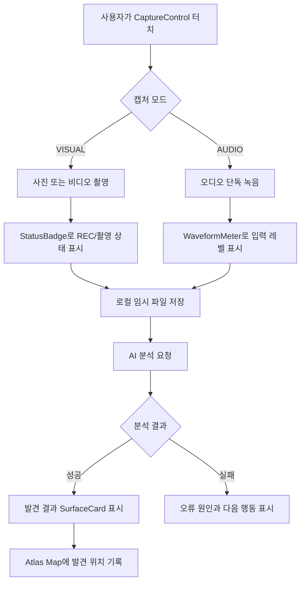
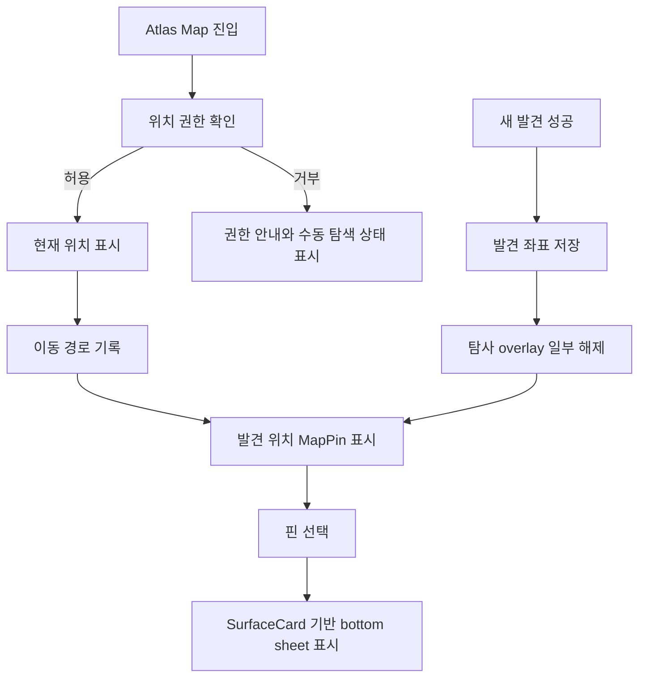

# Atlas System Workflow

이 문서는 Atlas의 캡처, AI 분석, 지도 탐사 흐름을 정의한다. UI 표현은 `Calm Field System`을 기준으로 하며, 과한 네온/픽셀 연출은 결과 획득 순간에만 제한한다.

## 1. Capture And AI Analysis Workflow

### UI Rules
- recording 상태는 `StatusBadge`와 `CaptureControl` 상태로 표현한다.
- 분석 중에는 primary action을 loading/disabled로 전환한다.
- 실패 상태는 `color.semantic.danger`만으로 끝내지 말고 다시 시도할 행동을 함께 제공한다.

## 2. Atlas Map Workflow

### UI Rules
- 지도 위 텍스트는 최소화한다. 상세 정보는 bottom sheet에서 제공한다.
- 현재 위치, 발견 위치, 커뮤니티 핫스팟은 `MapPin` variant로 구분한다.
- 미탐사 영역은 낮은 대비 grid overlay로 표현한다.

## 3. Screen Transition Workflow

### 3.1 App Launch
- font와 권한 상태를 확인한다.
- 본문 UI는 시스템 폰트로 즉시 표시하고, display font는 로드 후 특수 영역에만 적용한다.

### 3.2 Capture To Result
- 캡처 완료 후 분석 pending 상태로 전환한다.
- 분석 성공 시 결과 bottom sheet를 열고 발견명, 신뢰도, 특징, 위치 metadata를 표시한다.

### 3.3 Result To Map
- 사용자가 `지도에서 보기`를 선택하면 해당 발견 위치를 중심으로 Atlas Map을 연다.
- 선택된 `MapPin`에는 selected ring을 표시하고, 상세 bottom sheet를 함께 연다.

## 4. Motion Rules

- press feedback: `motion.duration.fast`, `motion.scale.pressed`
- 일반 상태 전환: `motion.duration.base`
- bottom sheet 진입: `motion.duration.slow`
- REC dot, waveform, overlay 해제 외에는 반복 애니메이션을 사용하지 않는다.
