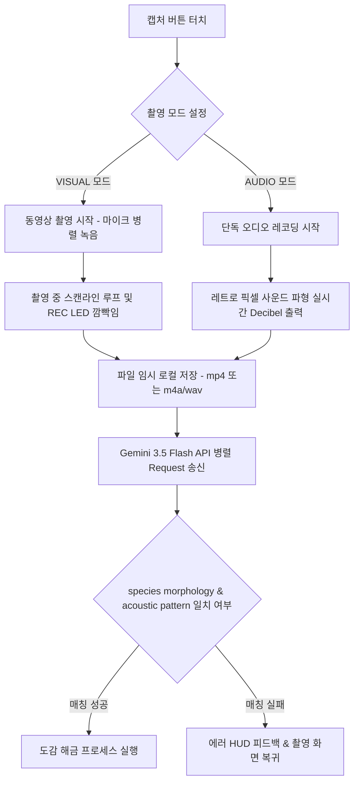
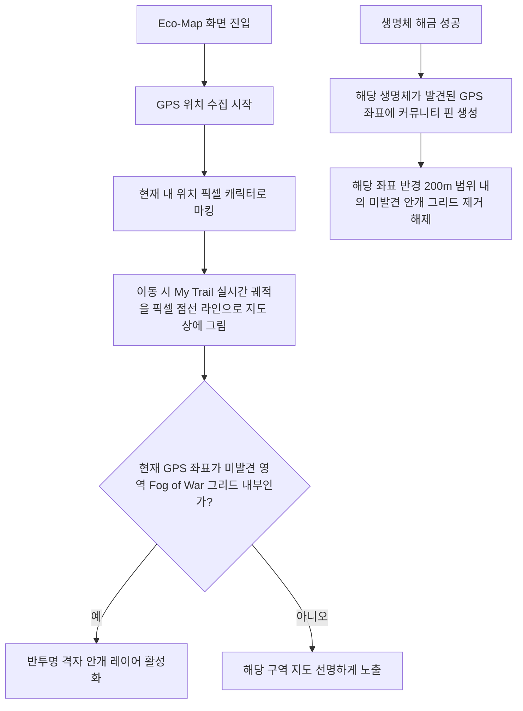

# 시스템 워크플로우 정의서 (System Workflow)

이 문서는 에코 도감(Eco-Pokedex) 프로젝트의 사용자 시나리오별 미디어 처리, AI 분석, 지도 탐사 연동 및 데이터 상태 흐름(Workflow)을 도식화하고 상세히 정의합니다.

---

## 1. 캡처 및 AI 분석 워크플로우

사용자가 생명체를 포착하여 Gemini 3.5 Flash 분석을 받고 도감을 해금하기까지의 미디어 데이터 상태 전이 흐름입니다.

---

## 2. 지역 지도 기반 생태 탐사 워크플로우 (Eco-Map)

사용자의 현재 위치와 도감 수집 상태가 어떻게 탐사 지도(Eco-Map)와 연결되는지를 나타냅니다.

---

## 3. 화면 전환 워크플로우 (12 UI Animation 원칙 연동)

1.  **진입 대기 (Splash Screen)**:
    *   앱 최초 실행 시 `pokemon-bw.ttf` 로딩 상태 감시.
    *   로딩 완료 시 메인 도감 뷰(Dex Grid)로 페이드 아웃 전환.
2.  **도감 카드 상세 열기 (Detail Transition)**:
    *   사용자가 목록 내 카드를 터치하면, 카드의 배경색과 테두리가 확대되면서 상세 모달로 변형(Transformation) 전개. (Shared Element Transition 동작)
3.  **수치 카운팅 및 해금 연출 (Value & Lottie)**:
    *   도감 등록 시 `success_unlock.json` Lottie 애니메이션이 재생되면서 별가루 효과 오버레이.
    *   새로 얻은 동식물의 통계치 게이지바가 상승하며 실시간 수치 카운팅 적용.
