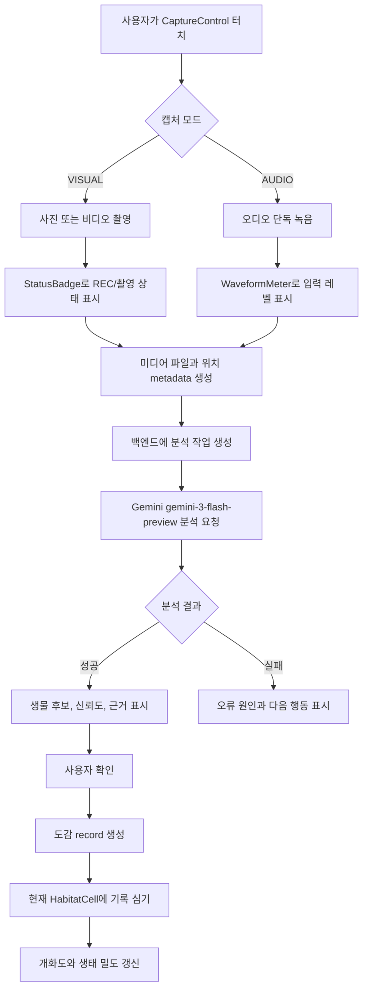
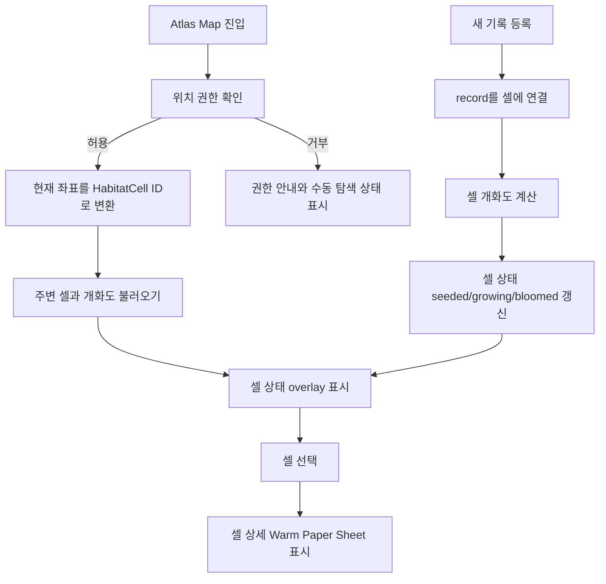
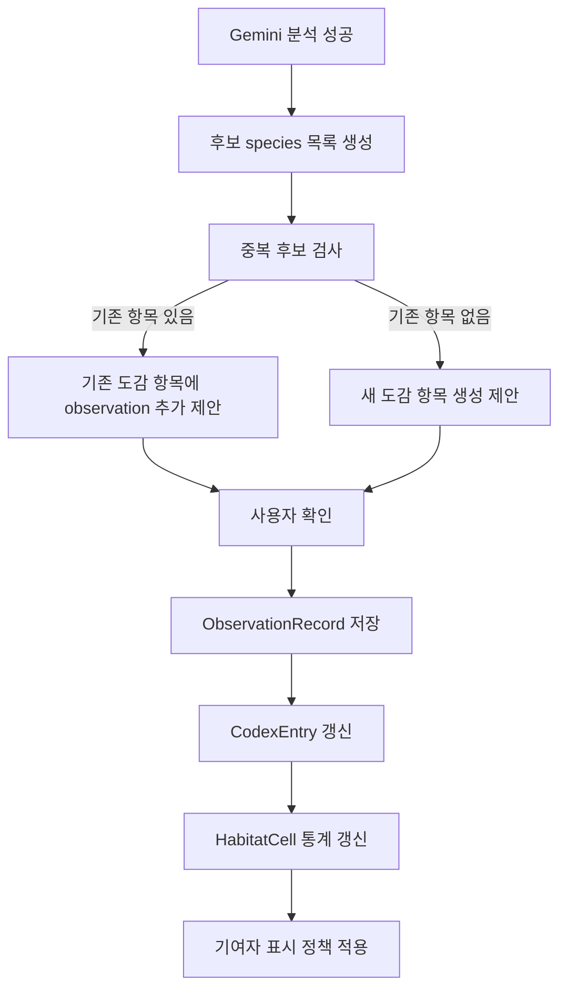

# Atlas System Workflow

이 문서는 Atlas의 캡처, Gemini 분석, 지도 셀 도감화 흐름을 정의한다. UI 표현은 `Habitat Bloom` 방향을 기준으로 하며, 사용자가 실제 위치에서 기록을 심을수록 지도 위 서식지 셀이 피어나는 경험을 만든다.

## 1. Capture And Gemini Analysis Workflow

### UI Rules
- recording 상태는 `StatusBadge`와 `CaptureControl` 상태로 표현한다.
- 분석 중에는 primary action을 loading/disabled로 전환한다.
- 분석 결과는 확정이 아니라 `추정`으로 표현한다. 예: `노랑나비로 추정`.
- 실패 상태는 `color.semantic.danger`만으로 끝내지 말고 다시 시도할 행동을 함께 제공한다.
- 사용자가 분석 결과를 확인한 뒤 `지도에 심기`를 눌러 도감 등록을 완료한다.

## 2. Habitat Cell Map Workflow

### UI Rules
- 지도는 셀 overlay를 기본 정보 구조로 사용한다.
- 지도 위 텍스트는 최소화하고 셀 상세는 bottom sheet에서 제공한다.
- 셀 상태는 `unobserved`, `visited`, `seeded`, `growing`, `bloomed`로 구분한다.
- 공개 지도에는 정확 좌표가 아니라 셀 단위 위치와 기여자 표시명을 우선 사용한다.

## 3. Codex Registration Workflow

### Data Rules
- `ObservationRecord`는 원본 관찰 이벤트다.
- `CodexEntry`는 같은 생물 후보를 지역/셀 단위로 묶은 도감 항목이다.
- `HabitatCell`은 지도 위 셀의 상태, 개화도, 기록 수, 대표 생물 후보를 가진다.
- 한 관찰 기록은 하나의 정확 좌표를 가질 수 있지만, 공개 표시는 셀 centroid 또는 흐린 위치를 사용한다.
- 기여자 이름은 사용자가 공개를 허용한 경우에만 표시한다.

## 4. Screen Transition Workflow

### 3.1 App Launch
- font와 권한 상태를 확인한다.
- 주변 `HabitatCell` 요약과 최근 도감 기록을 불러온다.

### 3.2 Capture To Result
- 캡처 완료 후 분석 pending 상태로 전환한다.
- 분석 성공 시 결과 sheet를 열고 생물 후보, 신뢰도, 관찰 근거, 위치 metadata를 표시한다.

### 3.3 Result To Map
- 사용자가 `지도에 심기`를 선택하면 해당 위치의 `HabitatCell`에 기록을 등록한다.
- 등록 후 셀의 개화도 변화와 새 도감 항목을 보여준다.

## 4. Motion Rules

- press feedback: `motion.duration.fast`, `motion.scale.pressed`
- 일반 상태 전환: `motion.duration.base`
- bottom sheet 진입: `motion.duration.slow`
- REC dot, waveform, bloom ring 외에는 반복 애니메이션을 사용하지 않는다.
